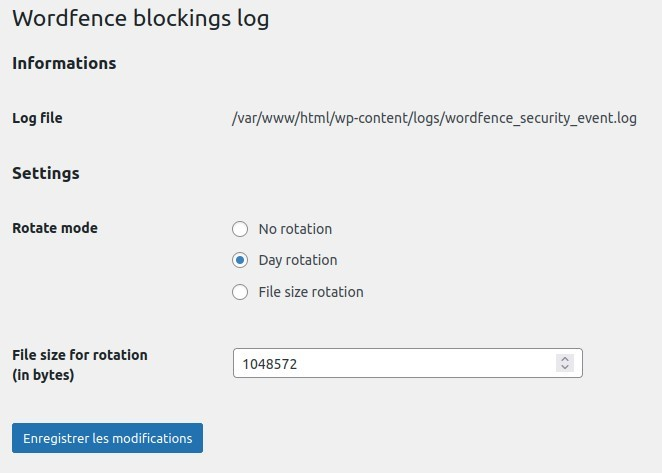

# Wordpress Wordfence blockings log

A [Wordpress](https://wordpress.org/) plugin which logs [Wordfence](https://www.wordfence.com/) IP blockings to make them available to other software such as [Crowdsec](https://www.crowdsec.net/).

## Configuration

Options page is available in Tools admin menu.

## Thanks & Credits

- https://developer.wordpress.org for Wordpress developer documentation
- https://github.com/jeremyHixon/RationalOptionPages for Settings & Options page