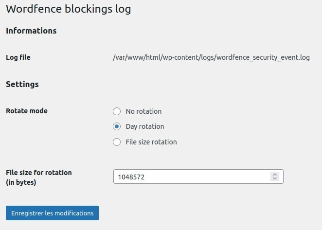

# Wordpress Wordfence blockings log

A [Wordpress](https://wordpress.org/) plugin which logs [Wordfence](https://www.wordfence.com/) IP blockings to make them available to other software such as [Crowdsec](https://www.crowdsec.net/).

## Configuration

Options page is available in Tools admin menu.

The only setting is about the log file rotation. You have 3 choices:
- no rotation: nothing append, you can manage rotation with a tool like logrotage
- day rotation: the log file will be renamed as "...-2024-08-03.log" when the file's modification date is older than the incoming event
- size rotation: the log file will be renamed as "...20240803_154103" when it become bigger than the file size setting

## Crowdsec side

You'll find in `crowdsec/hub` folder :
- the parser `crowdsec/hub/wordpress-wordfence-blockings-log.yaml`
- scenario `crowdsec/hub/wordpress-wordfence-blockings-wsn.yaml` to propagate Wordfence Security Network IP to Crowdsec, only those who have visited the website
- scenario `crowdsec/hub/wordpress-wordfence-blockings-san.yaml` to propagate to Crowdsec IP who have exceeded a maximum requests per minutes

## Thanks & Credits

- https://developer.wordpress.org for Wordpress developer documentation
- https://github.com/jeremyHixon/RationalOptionPages for Settings & Options page
